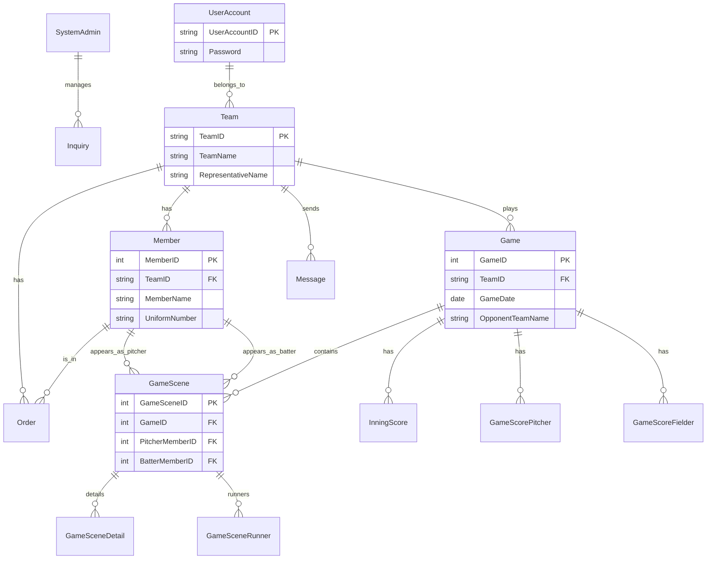

# DB設計書

## 1. ER図

## 2. テーブル一覧

| 物理名 | 論理名 | 説明 |
| --- | --- | --- |
| SystemAdmin | システム管理者 | システム管理者のアカウント情報 |
| UserAccount | ユーザーアカウント | 一般ユーザーのアカウント情報 |
| Team | チーム | チームの基本情報 |
| Member | メンバー | チームに所属する選手情報 |
| Game | 試合 | 試合の基本情報（日時、場所、対戦相手など） |
| GameScene | 試合経過 | 1打席ごとの試合経過情報 |
| GameSceneDetail | 試合経過詳細 | 打席内の詳細情報（盗塁、暴投など） |
| GameSceneRunner | 試合経過ランナー | ランナーの移動情報 |
| GameScoreFielder | 野手成績 | 試合ごとの野手成績 |
| GameScorePitcher | 投手成績 | 試合ごとの投手成績 |
| InningScore | イニングスコア | イニングごとの得点情報 |
| Message | メッセージ | ユーザー間のメッセージ |
| Order | オーダー | 試合のスターティングメンバー情報 |
| Inquiry | 問い合わせ | ユーザーからの問い合わせ情報 |

## 3. テーブル定義詳細

### SystemAdmin (システム管理者)
| カラム名 | 論理名 | 型 | 必須 | 説明 |
| --- | --- | --- | --- | --- |
| SystemAdminClass | システム管理区分 | enum | Yes | PK |
| MessageTitle | メッセージタイトル | string | No | |
| MessageDetail | メッセージ | string | No | |

### UserAccount (ユーザーアカウント)
| カラム名 | 論理名 | 型 | 必須 | 説明 |
| --- | --- | --- | --- | --- |
| UserAccountID | ユーザID | string | Yes | PK |
| UserAccountName | ユーザ名 | string | Yes | |
| TeamID | チームID | string | No | FK(Team) |
| Password | パスワード | string | No | |
| EmailAddress | メールアドレス | string | No | |
| DeleteFLG | 削除フラグ | bool | Yes | |

### Team (チーム)
| カラム名 | 論理名 | 型 | 必須 | 説明 |
| --- | --- | --- | --- | --- |
| TeamID | チームID | string | Yes | PK |
| TeamName | チーム名 | string | Yes | |
| TeamAbbreviation | チーム略名 | string | Yes | |
| RepresentativeName | 代表者名 | string | No | |
| TeamCategoryClass | カテゴリ | enum | No | |
| UseBallClass | 使用球 | enum | No | |
| ActivityBase | 活動拠点 | string | No | |
| TeamNumber | チーム人数 | int | No | |
| TeamPassword | パスワード | string | No | |
| TeamEmailAddress | メールアドレス | string | No | |
| PublicFLG | 公開フラグ | bool | Yes | |
| DeleteFLG | 削除フラグ | bool | Yes | |

### Member (メンバー)
| カラム名 | 論理名 | 型 | 必須 | 説明 |
| --- | --- | --- | --- | --- |
| MemberID | メンバーID | int | Yes | PK |
| TeamID | チームID | string | Yes | FK(Team) |
| UniformNumber | 背番号 | string | No | |
| MemberName | 名前 | string | Yes | |
| MemberClass | メンバー区分 | enum | No | 選手、監督、コーチなど |
| ThrowClass | 投 | enum | No | 右投、左投など |
| BatClass | 打 | enum | No | 右打、左打など |
| PositionGroupClass | ポジション | enum | No | 投手、捕手、内野手、外野手 |
| DeleteFLG | 削除フラグ | bool | Yes | |

### Game (試合)
| カラム名 | 論理名 | 型 | 必須 | 説明 |
| --- | --- | --- | --- | --- |
| GameID | 試合ID | int | Yes | PK |
| TeamID | チームID | string | Yes | FK(Team) |
| GameDate | 日付 | date | Yes | |
| GameClass | 試合種別 | enum | No | 公式戦、練習試合など |
| OpponentTeamName | 相手チーム名 | string | No | |
| StadiumName | 球場 | string | No | |
| WinLoseClass | 勝敗 | enum | No | |
| Score | 得点 | int | No | |
| OpponentTeamScore | 失点 | int | No | |
| StatusClass | ステータス | enum | No | 試合前、試合中、試合終了 |

### GameScene (試合経過)
| カラム名 | 論理名 | 型 | 必須 | 説明 |
| --- | --- | --- | --- | --- |
| GameSceneID | 試合シーンID | int | Yes | PK |
| GameID | 試合ID | int | Yes | FK(Game) |
| Inning | イニング | int | Yes | |
| TopButtomClass | 表裏 | enum | No | |
| PitcherMemberID | 投手 | int | No | FK(Member) |
| BatterMemberID | 打者 | int | No | FK(Member) |
| OutCount | OUTカウント | int | Yes | |
| RunnerSceneClass | ランナー | enum | Yes | |
| ResultClass | 結果 | enum | Yes | |
| Run | 得点 | int | No | |
| RBI | 打点 | int | No | |

### GameSceneDetail (試合経過詳細)
| カラム名 | 論理名 | 型 | 必須 | 説明 |
| --- | --- | --- | --- | --- |
| GameSceneDetailID | 試合シーン詳細ID | int | Yes | PK |
| GameSceneID | 試合シーンID | int | No | FK(GameScene) |
| SceneResultClass | シーン結果区分 | enum | No | |
| DetailResultClass | 結果 | enum | No | |

### GameSceneRunner (試合経過ランナー)
| カラム名 | 論理名 | 型 | 必須 | 説明 |
| --- | --- | --- | --- | --- |
| GameSceneRunnerID | 試合シーンランナーID | int | Yes | PK |
| GameSceneID | 試合シーンID | int | No | FK(GameScene) |
| BeforeRunnerClass | 打席中ランナー | enum | No | |
| RunnerClass | ランナー | enum | No | |
| RunnerResultClass | 結果 | enum | No | |

### InningScore (イニングスコア)
| カラム名 | 論理名 | 型 | 必須 | 説明 |
| --- | --- | --- | --- | --- |
| InningScoreID | イニングスコアID | int | Yes | PK |
| GameID | 試合ID | int | Yes | FK(Game) |
| Inning | イニング | int | Yes | |
| TopButtomClass | 表裏 | enum | No | |
| Score | 得点 | int | No | |

### Order (オーダー)
| カラム名 | 論理名 | 型 | 必須 | 説明 |
| --- | --- | --- | --- | --- |
| OrderID | オーダーID | int | Yes | PK |
| GameID | 試合ID | int | Yes | FK(Game) |
| MemberID | メンバーID | int | Yes | FK(Member) |
| BattingOrder | 打順 | decimal | No | |
| PositionClass | 守備位置 | enum | No | |
| ParticipationClass | 出場区分 | enum | No | スタメン、途中出場など |

### Message (メッセージ)
| カラム名 | 論理名 | 型 | 必須 | 説明 |
| --- | --- | --- | --- | --- |
| MessageID | メッセージID | int | Yes | PK |
| TeamID | 送信元チームID | string | Yes | FK(Team) |
| PrivateTeamID | 送信先チームID | string | No | FK(Team) |
| Title | タイトル | string | Yes | |
| MessageDetail | 内容 | string | Yes | |
| MessageStatusClass | ステータス | enum | No | 未読、既読など |

### Inquiry (問い合わせ)
| カラム名 | 論理名 | 型 | 必須 | 説明 |
| --- | --- | --- | --- | --- |
| InquiryID | 問い合わせID | int | Yes | PK |
| UserAccountID | ユーザーID | string | No | FK(UserAccount) |
| InquiryTitle | タイトル | string | Yes | |
| InquiryDetail | 内容 | string | Yes | |
| ReplyDetail | 返信内容 | string | No | |
| StatusClass | ステータス | enum | No | 未対応、対応中、完了 |
