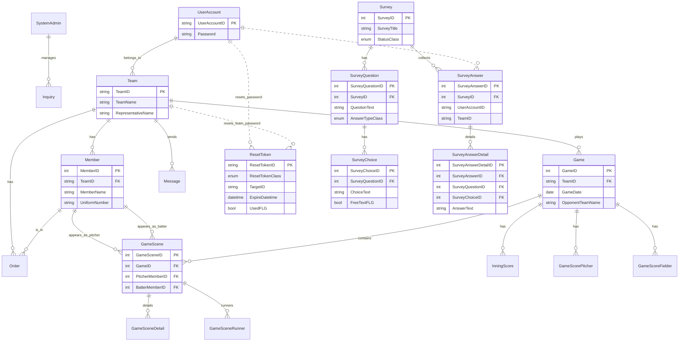

# DB設計書

## 1. ER図

```mermaid
erDiagram
    SystemAdmin ||--o{ Inquiry : manages
    UserAccount ||--o{ Team : belongs_to
    Team ||--o{ Member : has
    Team ||--o{ Game : plays
    Team ||--o{ Order : has
    Team ||--o{ Message : sends
    Member ||--o{ Order : is_in
    Member ||--o{ GameScene : appears_as_pitcher
    Member ||--o{ GameScene : appears_as_batter
    Game ||--o{ GameScene : contains
    Game ||--o{ InningScore : has
    Game ||--o{ GameScorePitcher : has
    Game ||--o{ GameScoreFielder : has
    GameScene ||--o{ GameSceneDetail : details
    GameScene ||--o{ GameSceneRunner : runners
    UserAccount ||..o{ ResetToken : resets_password
    Team ||..o{ ResetToken : resets_team_password
    Survey ||--o{ SurveyQuestion : has
    SurveyQuestion ||--o{ SurveyChoice : has
    Survey ||--o{ SurveyAnswer : collects
    SurveyAnswer ||--o{ SurveyAnswerDetail : details
    UserAccount ||..o{ SurveyAnswer : answers

    UserAccount {
        string UserAccountID PK
        string Password
    }
    Team {
        string TeamID PK
        string TeamName
        string RepresentativeName
    }
    Member {
        int MemberID PK
        string TeamID FK
        string MemberName
        string UniformNumber
    }
    Game {
        int GameID PK
        string TeamID FK
        date GameDate
        string OpponentTeamName
    }
    GameScene {
        int GameSceneID PK
        int GameID FK
        int PitcherMemberID FK
        int BatterMemberID FK
    }
    ResetToken {
        string ResetTokenID PK
        enum ResetTokenClass
        string TargetID
        datetime ExpireDatetime
        bool UsedFLG
    }
    Survey {
        int SurveyID PK
        string SurveyTitle
        enum StatusClass
    }
    SurveyQuestion {
        int SurveyQuestionID PK
        int SurveyID FK
        string QuestionText
        enum AnswerTypeClass
    }
    SurveyChoice {
        int SurveyChoiceID PK
        int SurveyQuestionID FK
        string ChoiceText
        bool FreeTextFLG
    }
    SurveyAnswer {
        int SurveyAnswerID PK
        int SurveyID FK
        string UserAccountID
        string TeamID
    }
    SurveyAnswerDetail {
        int SurveyAnswerDetailID PK
        int SurveyAnswerID FK
        int SurveyQuestionID FK
        int SurveyChoiceID FK
        string AnswerText
    }
```

※ResetToken の TargetID は UserAccountID または TeamID を保持する（区分により切り替わるため、DB上のFK制約は設定しない）。

## 2. テーブル一覧

| 物理名 | 論理名 | 説明 |
| --- | --- | --- |
| SystemAdmin | システム管理者 | システム管理者のアカウント情報 |
| UserAccount | ユーザーアカウント | 一般ユーザーのアカウント情報 |
| Team | チーム | チームの基本情報 |
| Member | メンバー | チームに所属する選手情報 |
| Game | 試合 | 試合の基本情報（日時、場所、対戦相手など） |
| GameScene | 試合経過 | 1打席ごとの試合経過情報 |
| GameSceneDetail | 試合経過詳細 | 打席内の詳細情報（盗塁、暴投など） |
| GameSceneRunner | 試合経過ランナー | ランナーの移動情報 |
| GameScoreFielder | 野手成績 | 試合ごとの野手成績 |
| GameScorePitcher | 投手成績 | 試合ごとの投手成績 |
| InningScore | イニングスコア | イニングごとの得点情報 |
| Message | メッセージ | ユーザー間のメッセージ |
| Order | オーダー | 試合のスターティングメンバー情報 |
| Inquiry | 問い合わせ | ユーザーからの問い合わせ情報 |
| ResetToken | 再設定トークン | パスワード・チームパスワードの再設定用トークン |
| Survey | アンケート | アンケートの定義 |
| SurveyQuestion | アンケート設問 | 設問。アンケートに紐づく |
| SurveyChoice | アンケート選択肢 | 選択肢。設問に紐づく |
| SurveyAnswer | アンケート回答 | 回答ヘッダ（誰が・いつ答えたか） |
| SurveyAnswerDetail | アンケート回答明細 | 設問ごとの回答内容 |

## 3. テーブル定義詳細

### SystemAdmin (システム管理者)
| カラム名 | 論理名 | 型 | 必須 | 説明 |
| --- | --- | --- | --- | --- |
| SystemAdminClass | システム管理区分 | enum | Yes | PK |
| MessageTitle | メッセージタイトル | string | No | |
| MessageDetail | メッセージ | string | No | |

### UserAccount (ユーザーアカウント)
| カラム名 | 論理名 | 型 | 必須 | 説明 |
| --- | --- | --- | --- | --- |
| UserAccountID | ユーザID | string | Yes | PK |
| UserAccountName | ユーザ名 | string | Yes | |
| TeamID | チームID | string | No | FK(Team) |
| Password | パスワード | string | No | |
| EmailAddress | メールアドレス | string | No | |
| DeleteFLG | 削除フラグ | bool | Yes | |

### Team (チーム)
| カラム名 | 論理名 | 型 | 必須 | 説明 |
| --- | --- | --- | --- | --- |
| TeamID | チームID | string | Yes | PK |
| TeamName | チーム名 | string | Yes | |
| TeamAbbreviation | チーム略名 | string | Yes | |
| RepresentativeName | 代表者名 | string | No | |
| TeamCategoryClass | カテゴリ | enum | No | |
| UseBallClass | 使用球 | enum | No | |
| ActivityBase | 活動拠点 | string | No | |
| TeamNumber | チーム人数 | int | No | |
| TeamPassword | パスワード | string | No | |
| TeamEmailAddress | メールアドレス | string | No | |
| PublicFLG | 公開フラグ | bool | Yes | |
| DeleteFLG | 削除フラグ | bool | Yes | |

### Member (メンバー)
| カラム名 | 論理名 | 型 | 必須 | 説明 |
| --- | --- | --- | --- | --- |
| MemberID | メンバーID | int | Yes | PK |
| TeamID | チームID | string | Yes | FK(Team) |
| UniformNumber | 背番号 | string | No | |
| MemberName | 名前 | string | Yes | |
| MemberClass | メンバー区分 | enum | No | 選手、監督、コーチなど |
| ThrowClass | 投 | enum | No | 右投、左投など |
| BatClass | 打 | enum | No | 右打、左打など |
| PositionGroupClass | ポジション | enum | No | 投手、捕手、内野手、外野手 |
| DeleteFLG | 削除フラグ | bool | Yes | |

### Game (試合)
| カラム名 | 論理名 | 型 | 必須 | 説明 |
| --- | --- | --- | --- | --- |
| GameID | 試合ID | int | Yes | PK |
| TeamID | チームID | string | Yes | FK(Team) |
| GameDate | 日付 | date | Yes | |
| GameClass | 試合種別 | enum | No | 公式戦、練習試合など |
| OpponentTeamName | 相手チーム名 | string | No | |
| StadiumName | 球場 | string | No | |
| WinLoseClass | 勝敗 | enum | No | |
| Score | 得点 | int | No | |
| OpponentTeamScore | 失点 | int | No | |
| StatusClass | ステータス | enum | No | 試合前、試合中、確定前、確定済み（EndGame・EndGameLock） |

### GameScene (試合経過)
| カラム名 | 論理名 | 型 | 必須 | 説明 |
| --- | --- | --- | --- | --- |
| GameSceneID | 試合シーンID | int | Yes | PK |
| GameID | 試合ID | int | Yes | FK(Game) |
| Inning | イニング | int | Yes | |
| TopButtomClass | 表裏 | enum | No | |
| PitcherMemberID | 投手 | int | No | FK(Member) |
| BatterMemberID | 打者 | int | No | FK(Member) |
| OutCount | OUTカウント | int | Yes | |
| RunnerSceneClass | ランナー | enum | Yes | |
| ResultClass | 結果 | enum | Yes | |
| Run | 得点 | int | No | |
| RBI | 打点 | int | No | |

### GameSceneDetail (試合経過詳細)
| カラム名 | 論理名 | 型 | 必須 | 説明 |
| --- | --- | --- | --- | --- |
| GameSceneDetailID | 試合シーン詳細ID | int | Yes | PK |
| GameSceneID | 試合シーンID | int | No | FK(GameScene) |
| SceneResultClass | シーン結果区分 | enum | No | |
| DetailResultClass | 結果 | enum | No | |

### GameSceneRunner (試合経過ランナー)
| カラム名 | 論理名 | 型 | 必須 | 説明 |
| --- | --- | --- | --- | --- |
| GameSceneRunnerID | 試合シーンランナーID | int | Yes | PK |
| GameSceneID | 試合シーンID | int | No | FK(GameScene) |
| BeforeRunnerClass | 打席中ランナー | enum | No | |
| RunnerClass | ランナー | enum | No | |
| RunnerResultClass | 結果 | enum | No | |

### InningScore (イニングスコア)
| カラム名 | 論理名 | 型 | 必須 | 説明 |
| --- | --- | --- | --- | --- |
| InningScoreID | イニングスコアID | int | Yes | PK |
| GameID | 試合ID | int | Yes | FK(Game) |
| Inning | イニング | int | Yes | |
| TopButtomClass | 表裏 | enum | No | |
| Score | 得点 | int | No | |

### Order (オーダー)
| カラム名 | 論理名 | 型 | 必須 | 説明 |
| --- | --- | --- | --- | --- |
| OrderID | オーダーID | int | Yes | PK |
| GameID | 試合ID | int | Yes | FK(Game) |
| MemberID | メンバーID | int | Yes | FK(Member) |
| BattingOrder | 打順 | decimal | No | |
| PositionClass | 守備位置 | enum | No | |
| ParticipationClass | 出場区分 | enum | No | スタメン、途中出場など |

### Message (メッセージ)
| カラム名 | 論理名 | 型 | 必須 | 説明 |
| --- | --- | --- | --- | --- |
| MessageID | メッセージID | int | Yes | PK |
| TeamID | 送信元チームID | string | Yes | FK(Team) |
| PrivateTeamID | 送信先チームID | string | No | FK(Team) |
| Title | タイトル | string | Yes | |
| MessageDetail | 内容 | string | Yes | |
| MessageStatusClass | ステータス | enum | No | 未読、既読など |

### Inquiry (問い合わせ)
| カラム名 | 論理名 | 型 | 必須 | 説明 |
| --- | --- | --- | --- | --- |
| InquiryID | 問い合わせID | int | Yes | PK |
| UserAccountID | ユーザーID | string | No | FK(UserAccount) |
| InquiryTitle | タイトル | string | Yes | |
| InquiryDetail | 内容 | string | Yes | |
| ReplyDetail | 返信内容 | string | No | |
| StatusClass | ステータス | enum | No | 未対応、対応中、完了 |

### ResetToken (再設定トークン)
| カラム名 | 論理名 | 型 | 必須 | 説明 |
| --- | --- | --- | --- | --- |
| ResetTokenID | トークン | string(100) | Yes | PK。32バイトの乱数をBase64URL化した43文字 |
| ResetTokenClass | トークン区分 | enum | Yes | 1:ユーザパスワード, 2:チームパスワード |
| TargetID | 対象ID | string(50) | Yes | 区分1はUserAccountID、区分2はTeamID |
| ExpireDatetime | 有効期限 | datetime | Yes | 発行から1時間（SystemConstant.ResetTokenExpireHour） |
| UsedFLG | 使用済フラグ | bool | Yes | 使用後にtrue。1トークン1回のみ有効 |

- インデックス：IX_ResetToken_ResetTokenClass_TargetID (ResetTokenClass, TargetID)
- 同一対象へ新しいトークンを発行する際、その対象の未使用トークンはすべて使用済へ更新する
- 期限切れ・使用済のレコードは動作に影響しないが、定期的に削除して構わない
- 本テーブルは既存の本番DBには存在しないため、`doc/migration/20260920_password_reset.sql` で追加する
  （本DBは EnsureCreated で作成しているため、モデル追加だけでは既存DBへ反映されない）

### Survey (アンケート)
| カラム名 | 論理名 | 型 | 必須 | 説明 |
| --- | --- | --- | --- | --- |
| SurveyID | アンケートID | int | Yes | PK。自動採番 |
| SurveyTitle | タイトル | string(100) | Yes | 回答画面の見出し |
| SurveyDetail | 説明 | string | No | 回答画面の冒頭に表示する案内文 |
| StartDatetime | 開始日時 | datetime | No | 未設定の場合は制限なし |
| EndDatetime | 終了日時 | datetime | No | 未設定の場合は制限なし |
| StatusClass | 状態 | enum | Yes | 1:下書き 2:公開中 3:終了 |
| DeleteFLG | 削除フラグ | bool | Yes | |

- 回答を受け付けるのは「公開中」かつ「期間内」のもののみ
- 設問の作成は移行SQLで行う（管理画面からの設問作成は未実装）

### SurveyQuestion (アンケート設問)
| カラム名 | 論理名 | 型 | 必須 | 説明 |
| --- | --- | --- | --- | --- |
| SurveyQuestionID | 設問ID | int | Yes | PK。自動採番 |
| SurveyID | アンケートID | int | Yes | FK(Survey) |
| DisplayOrder | 表示順 | int | Yes | |
| QuestionText | 設問 | string(200) | Yes | |
| QuestionNote | 補足説明 | string(200) | No | 設問の下に小さく表示する |
| AnswerTypeClass | 回答形式 | enum | Yes | 1:単一選択 2:複数選択 3:自由記述 |
| RequiredFLG | 必須フラグ | bool | Yes | |
| MaxSelectCount | 選択上限数 | int | No | 複数選択時の上限（例：3つまで） |

### SurveyChoice (アンケート選択肢)
| カラム名 | 論理名 | 型 | 必須 | 説明 |
| --- | --- | --- | --- | --- |
| SurveyChoiceID | 選択肢ID | int | Yes | PK。自動採番 |
| SurveyQuestionID | 設問ID | int | Yes | FK(SurveyQuestion) |
| DisplayOrder | 表示順 | int | Yes | |
| ChoiceText | 選択肢 | string(200) | Yes | |
| FreeTextFLG | 自由入力フラグ | bool | Yes | 「その他」など、選択時に自由入力欄を表示する |

### SurveyAnswer (アンケート回答)
| カラム名 | 論理名 | 型 | 必須 | 説明 |
| --- | --- | --- | --- | --- |
| SurveyAnswerID | 回答ID | int | Yes | PK。自動採番 |
| SurveyID | アンケートID | int | Yes | FK(Survey) |
| UserAccountID | ユーザID | string(50) | Yes | 回答者 |
| TeamID | チームID | string(50) | No | **回答時点**のチーム。後からチームを移動しても集計がぶれないよう保持する |
| AnswerDatetime | 回答日時 | datetime | Yes | |

- インデックス：IX_SurveyAnswer_SurveyID_UserAccountID (SurveyID, UserAccountID) **UNIQUE**
  → 同一ユーザの二重回答を防ぐ。回答済み判定にも使用する

### SurveyAnswerDetail (アンケート回答明細)
| カラム名 | 論理名 | 型 | 必須 | 説明 |
| --- | --- | --- | --- | --- |
| SurveyAnswerDetailID | 回答明細ID | int | Yes | PK。自動採番 |
| SurveyAnswerID | 回答ID | int | Yes | FK(SurveyAnswer) |
| SurveyQuestionID | 設問ID | int | Yes | |
| SurveyChoiceID | 選択肢ID | int | No | 選択式の場合に設定。自由記述の場合はNULL |
| AnswerText | 自由記述 | string | No | 自由記述、および「その他」選択時の入力内容 |

- 複数選択の場合、選択された数だけ明細を作成する
- **列名を AnswerText としているのは、`FreeText` がSQL Serverの予約語（全文検索の FREETEXT 述語）のため**
- インデックス：IX_SurveyAnswerDetail_SurveyAnswerID (SurveyAnswerID)
- 本テーブル群は既存の本番DBには存在しないため、`doc/migration/20260921_survey.sql` で追加する
